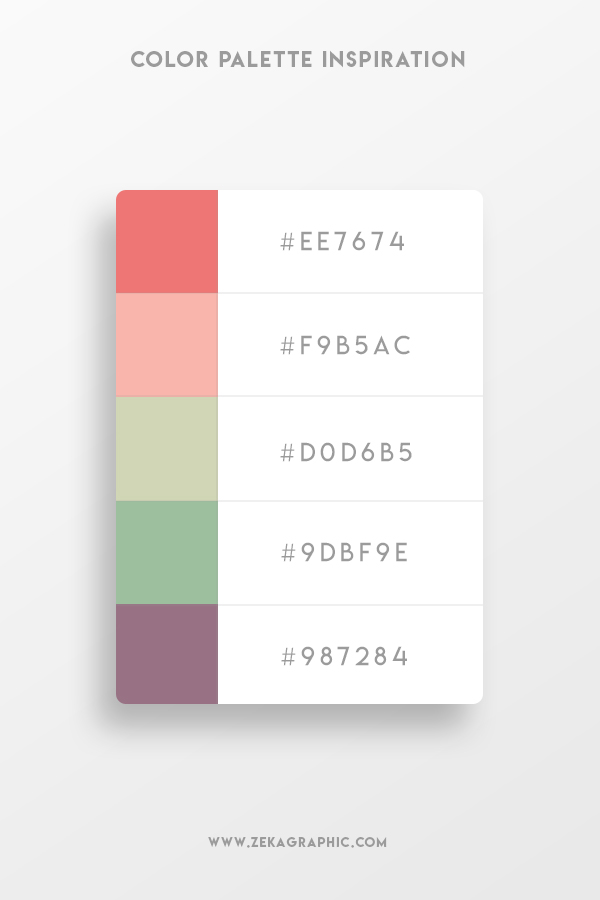

## 사용법 

### color



### code hilight

```html
    <pre><code data-language="css">
        h4 {
            padding-left: 10px;
            padding-right: 10px;
        }
    </code></pre>
```

### 제목 

```html
<h2 class="post-title">HTML과 CSS는 무엇인가?</h2>
```

### 명언 

```html
<p class="post-sub-title">언제나 현재에 집중할수 있다면 행복할것이다. <span>-파울로 코엘료</span></p>
```

### 내용

```html
    <div class="post-content">
        <p>안녕하세요? 저는 48세에 코딩 공부하는 사람입니다.</p>
        <h3>포스트 부제목</h3>
        <p>여기는 본론입니다.</p>
        <h4>h4는 어떻까요?</h4>
       
    </div>
```

### 팁

```html
    <div class="tip">
        <h5>tip</h5>
        <p>여기는 팁 내용이다.</p>
    </div>
```